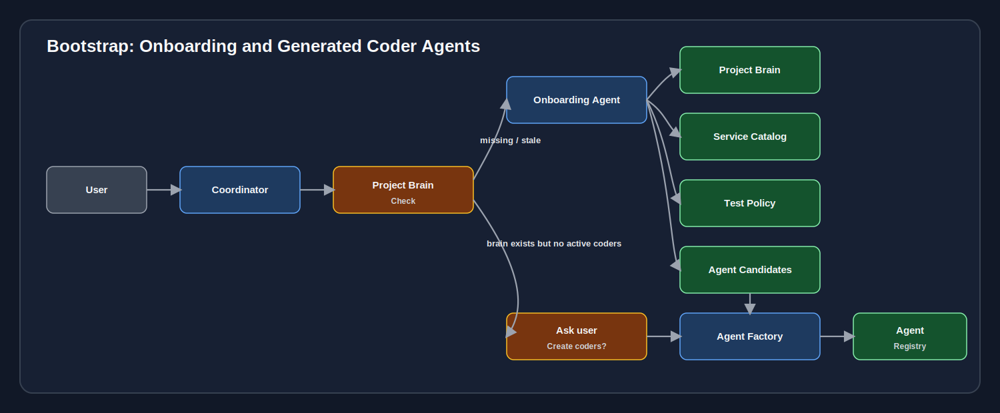
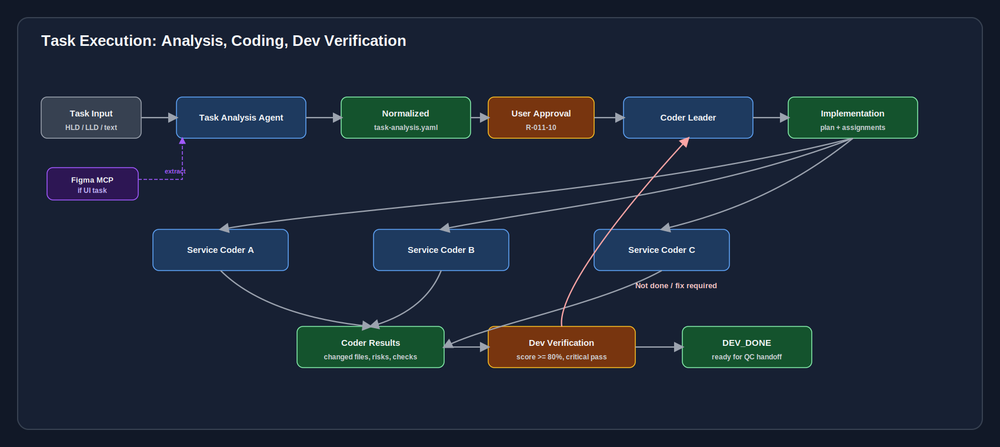
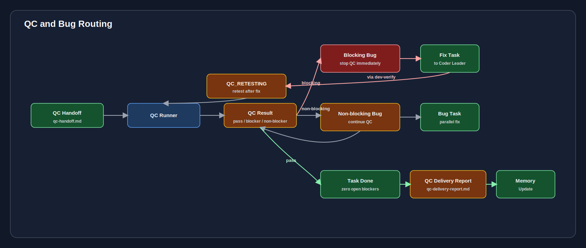
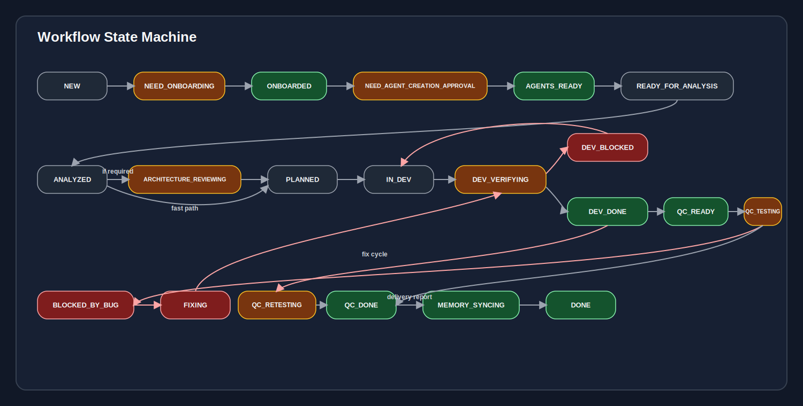
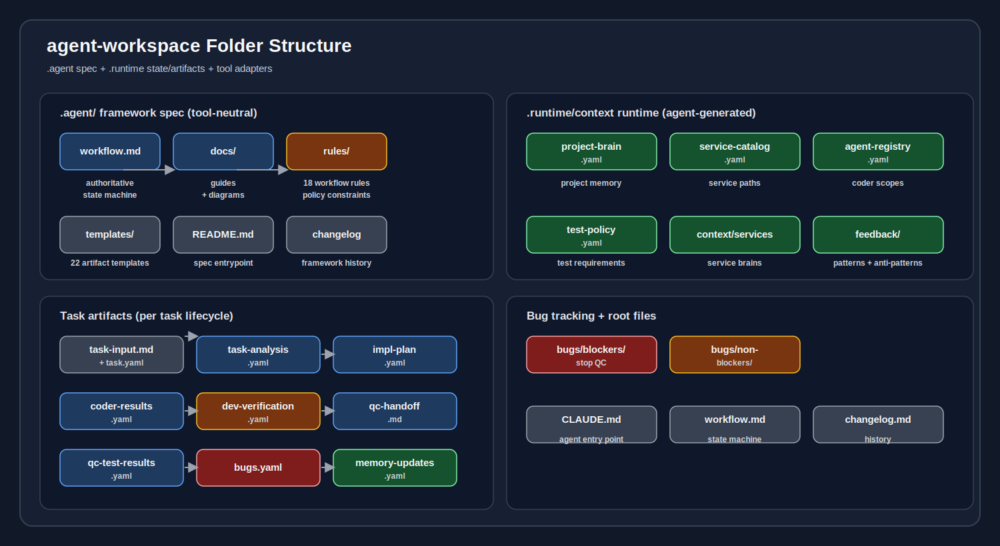
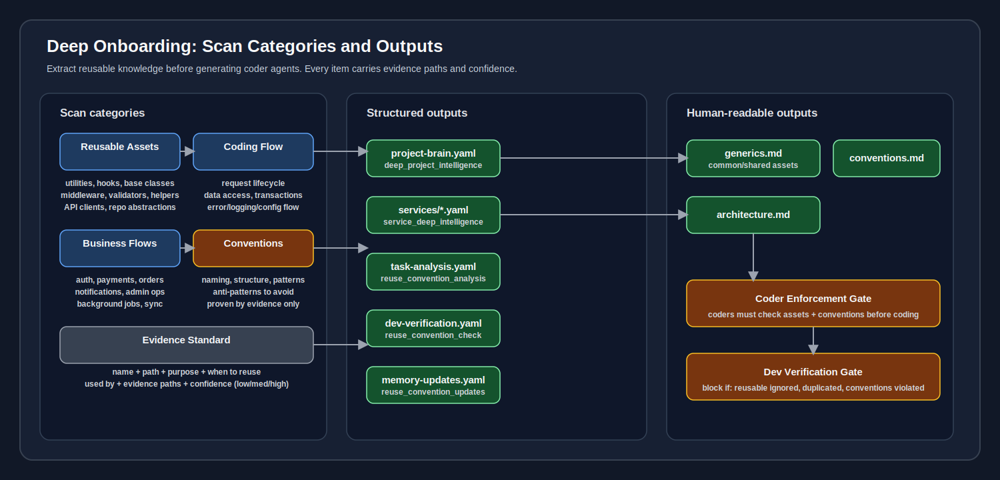
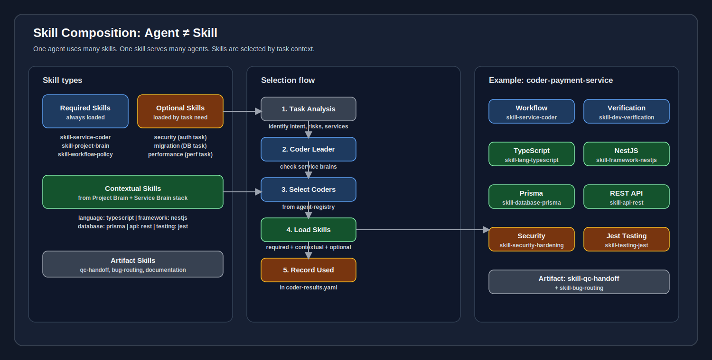
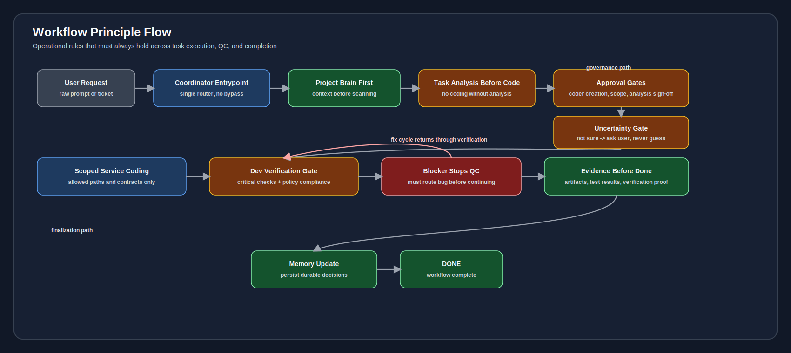
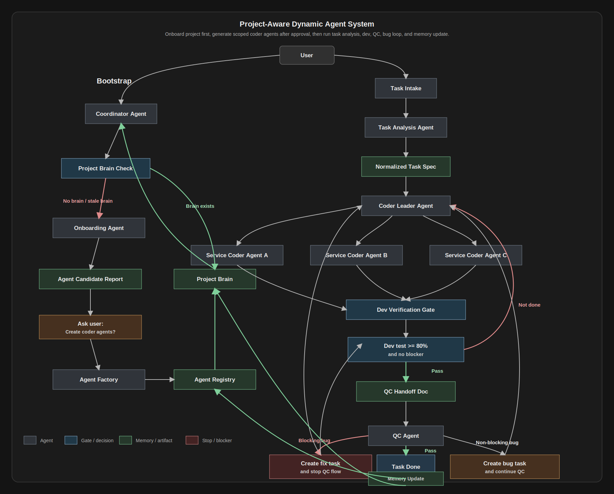

# Visual Workflow Design

This document is the visual entry point for the Project-Aware Dynamic Agent System.

The workflow is split into smaller diagrams instead of one large canvas. This keeps each diagram readable in Markdown preview and avoids tangled arrows.

## 1. System overview


Purpose: show the high-level agent architecture and the main responsibility boundary.
Includes the optional External MCPs panel (Figma MCP) on the right side, showing connections to Task Analysis and Implementation phases.

```text
User
-> Coordinator
-> Project Brain / Agent Registry / Workflow Policy
-> Onboarding or Task Execution
-> QC / Bug Routing / Memory Update
```

## 2. Bootstrap: onboarding and coder-agent creation



Purpose: show how the system prevents generic coders from being created before project analysis.

```text
No Project Brain or stale Project Brain
-> Onboarding Agent scans the project
-> Project Brain and Service Catalog are created
-> Coordinator asks user approval
-> Agent Factory generates scoped coder agents
-> Agent Registry becomes active
```

## 3. Task execution: analysis, coding, dev verification



Purpose: show the dev side of the workflow before QC.
Includes the optional Figma MCP box connected to Task Analysis for UI-related tasks.

```text
Task input
-> Task Analysis Agent
-> Normalized Task Spec
-> User Approval (user reviews task-analysis.yaml)
-> Solution Architect (only when architecture_review.required)
-> Coder Leader
-> Service Coder Agents
-> Dev Verification Gate
-> Code Done or back to dev
```

## 4. QC and bug routing



Purpose: show blocker and non-blocker behavior.

```text
QC Handoff
-> QC Runner
-> Blocking bug: stop QC → fix (via dev-verification) → QC_RETESTING → QC Runner
-> Non-blocking bug: create task and continue QC
-> Pass: QC Delivery Report to user, then memory update
```

## 5. State machine



Purpose: show valid task states and transitions.

## 6. Folder structure



Purpose: show how `.claude` is organized into definitions, memory, service control, state, task artifacts, and bug tracking.

```text
Definitions: agents, skills, rules, templates, commands, docs
Runtime: .runtime/context/index.yaml, project-brain, service-catalog, agent-registry, test-policy, workflow-state, feedback
Task artifacts: task-input through memory-updates per task
Bug tracking: blockers and non-blockers
Root files: CLAUDE.md, AGENTS.md, README.md, COMMAND.md, CHANGELOG.md
```

See also: [folder-guide.md](folder-guide.md)

## 7. Deep onboarding



Purpose: show how onboarding extracts reusable knowledge before coder agents are generated.

```text
Scan categories: Reusable Assets, Coding Flow, Business Flows, Conventions, Evidence Standard
Structured outputs: project-brain.yaml, services/*.yaml, task-analysis.yaml, dev-verification.yaml, memory-updates.yaml
Human-readable outputs: generics.md, conventions.md, architecture.md
Enforcement gate: coders must check assets and conventions before coding
Verification gate: block if reusable ignored, duplicated, or conventions violated
```

See also: [deep-onboarding.md](deep-onboarding.md)

## 8. Skill composition



Purpose: show how skills are selected, composed, and attached to agents.

```text
Skill types: Required (always loaded), Optional (by task need), Contextual (from project stack), Artifact (for outputs)
Selection flow: Task Analysis -> Coder Leader -> Select Coders -> Load Skills -> Record Used
Example: coder-payment-service combines workflow, language, framework, database, security, and artifact skills
```

See also: [skill-composition.md](skill-composition.md)

## 9. Principle flow



Purpose: show non-negotiable governance rules that must hold across all workflow phases.

```text
User Request
-> Coordinator only entrypoint
-> Project Brain first
-> Task analysis before coding
-> If uncertain: ask user, do not guess or fabricate facts
-> Approval gates enforced
-> Scoped coding + dev verification
-> Blocker stops QC and returns through fix cycle
-> Evidence before done
-> Memory update
-> DONE
```

## Visual conventions

```text
Blue: agent or active execution
Green: memory, registry, artifact, successful completion
Orange: approval or decision gate
Red: blocker or stop condition
Gray: external input or neutral artifact
Purple (Figma): external MCP service, optional integration
Purple dashed edge: external MCP call (tier-aware)
```

## Design rule

The diagrams are deliberately split by concern:

```text
System overview: who exists
Bootstrap flow: how project brain and coder agents are created
Task execution: how dev work is performed
QC and bug routing: how testing and defects are handled
State machine: what transitions are legal
Folder structure: how .claude is organized
Deep onboarding: how project knowledge is extracted
Skill composition: how skills are selected and attached to agents
Principle flow: non-negotiable operating rules across the pipeline
```

## Command layer

```text
/coord
  Main entrypoint. Checks brain, state, registry, and routes to the correct command.

/onboard
  Builds Project Brain, Service Catalog, Test Policy, Service Brain files, and agent candidates.

/create-coders
  Generates scoped coder agents after user approval.

/analyze-task -> /plan-dev -> /dev -> /verify-dev
  Development pipeline before QC.

/handoff-qc -> /qc -> /bug
  QC and defect handling pipeline.

/sync-memory
  Updates reusable memory after durable changes.
```

## Legacy diagram



The original single-canvas workflow diagram before the split into 9 focused diagrams. Kept for historical reference.

## Related documents

- [architecture-guide.md](architecture-guide.md) — System architecture
- [workflow-reference.md](workflow-reference.md) — Workflow states and commands
- [agent-catalog.md](agent-catalog.md) — Agent descriptions
- [skill-guide.md](skill-guide.md) — Skill system and composition
