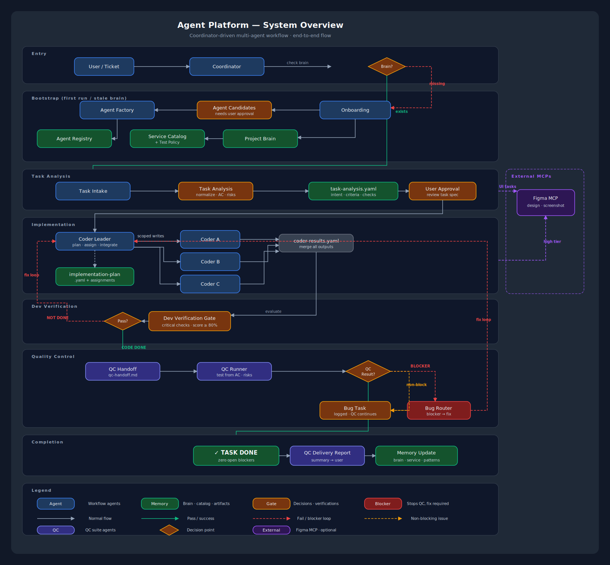
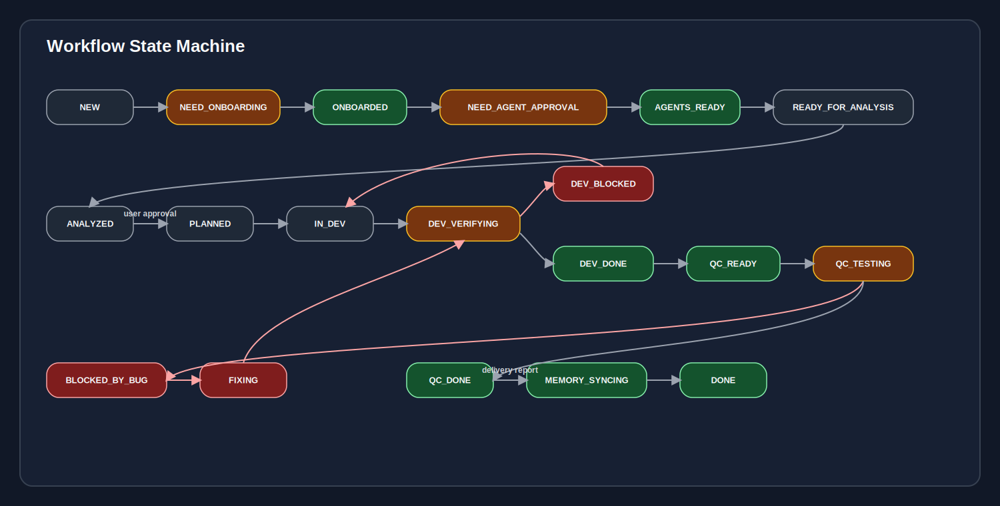
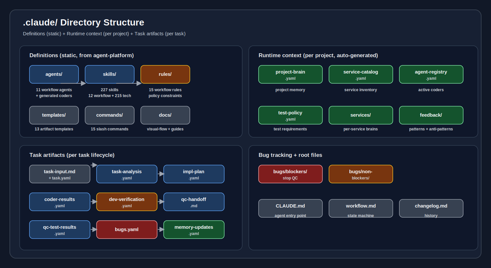

# Architecture Guide



This document describes the system architecture of the coordinator-driven multi-agent workflow.

## Design philosophy

The system follows a **coordinator-driven workflow** where no agent acts independently. Every task flows through a central coordinator that checks project state, routes to the right agent, enforces approval gates, and validates transitions.

Key architectural decisions:

```text
1. Coordinator-driven: one central router, no peer-to-peer agent communication
2. Project brain as memory: avoid rescanning the repository every conversation
3. Scoped coders: generated per service, never full-repo access
4. Task-first: no code before task analysis
5. Approval gates: destructive or scope-changing actions require user consent
6. Artifact contracts: every state transition requires specific artifacts
```

## System layers

```text
┌─────────────────────────────────────────────────────┐
│  User Layer                                         │
│  Natural language requests or /commands              │
└────────────────────┬────────────────────────────────┘
                     │
┌────────────────────▼────────────────────────────────┐
│  Routing Layer                                      │
│  Coordinator: routes, gates, state machine           │
│  Workflow Policy: validates transitions              │
└────────────────────┬────────────────────────────────┘
                     │
┌────────────────────▼────────────────────────────────┐
│  Knowledge Layer                                    │
│  Project Brain, Service Catalog, Agent Registry      │
│  Test Policy, Service Brains, Feedback Patterns      │
└────────────────────┬────────────────────────────────┘
                     │
┌────────────────────▼────────────────────────────────┐
│  Execution Layer                                    │
│  Task Analysis → User Approval → Coder Leader        │
│  → Service Coders                                    │
│  Dev Verification → QC Handoff → QC Runner           │
│  Bug Router → Memory Update                          │
└────────────────────┬────────────────────────────────┘
                     │
┌────────────────────▼────────────────────────────────┐
│  Artifact Layer                                     │
│  Tasks, Bugs, Handover docs, Memory updates          │
└─────────────────────────────────────────────────────┘
```

## Agent architecture

The system uses 11 fixed workflow agents plus unlimited generated service coders.

### Fixed agents (11)

These agents are defined once in `.claude/agents/` and are available to every project:

```text
Routing:      Coordinator, Workflow Policy
Knowledge:    Onboarding, Agent Factory, Memory Update
Execution:    Task Analysis, Coder Leader, Dev Verification
QC:           QC Handoff, QC Runner, Bug Router
```

### Generated agents (unlimited)

Agent Factory creates **service-specific coder agents** after onboarding and user approval. Each generated coder is scoped to one service with explicit read, write, and forbidden paths.

```text
Example for an e-commerce project:
  coder-api.agent.md       → Backend NestJS service
  coder-web.agent.md       → Frontend React app
  coder-shared.agent.md    → Shared packages
```

See also: [agent-catalog.md](agent-catalog.md) for detailed agent descriptions.

## Knowledge architecture


The **project brain** is the central knowledge store. It is created by onboarding and maintained by memory update.

### Knowledge hierarchy

```text
project-brain.yaml          ← Project-wide facts: stack, architecture, conventions
├── service-catalog.yaml    ← Service inventory and boundaries
├── test-policy.yaml        ← Test requirements per service
├── agent-registry.yaml     ← Active generated coders with scopes
└── services/
    ├── api.yaml            ← Service-specific deep intelligence
    ├── web.yaml
    └── shared.yaml
```

### Knowledge lifecycle

```text
1. Onboarding scans repository → creates project brain
2. Task analysis reads brain → understands impacted services
3. Coder leader reads brain → selects correct coders
4. Service coders read service brain → follow conventions
5. Memory update writes brain → persists new learnings
```

### Freshness model

The coordinator checks project brain freshness before routing. If stale or missing:

```text
Missing → full onboarding
Stale (known area) → partial rescan
Fresh → proceed to task routing
```

## Execution architecture


### Task lifecycle

```text
1. Task Analysis    → Normalize input into structured spec
2. User Approval    → User reviews and approves task-analysis.yaml
3. Coder Leader     → Create implementation plan, assign coders
4. Service Coders   → Implement within scoped boundaries
5. Dev Verification → Score ≥80% + critical checks = Code Done
6. QC Handoff       → Create mandatory handoff document
7. QC Runner        → Execute test cases from handoff
8. Bug Router       → Classify defects, route fixes
9. QC Delivery      → Write qc-delivery-report.md for user
10. Memory Update   → Persist durable learnings
```

### Cross-service coordination

Service coders cannot coordinate directly. All cross-service changes go through Coder Leader:

```text
Coder A needs change in Service B
  → Coder A raises cross_service_request
  → Coder Leader evaluates
  → Coder Leader assigns Coder B
  → Coder Leader validates integration
```

### Contract protection

Coder Leader protects shared contracts:

```text
API contracts      → endpoint signatures, request/response schemas
Event contracts    → event names, payloads, topics
Schema contracts   → database migrations, shared types
Package contracts  → shared library interfaces
```

## QC architecture


### Blocker vs non-blocker

```text
Blocker:
  Main flow blocked, crash, auth/security broken,
  data corruption risk, downstream QC cases blocked
  → Stop QC immediately → Coordinator → Coder Leader → fix → re-verify → retest

Non-blocker:
  Cosmetic, copy, layout, warning, rare edge case
  → QC continues on unaffected cases → optional parallel fix task
```

### QC completion

```text
QC_DONE requires:
  Zero open blocker bugs
  All test cases recorded in qc-test-results.yaml
```

## State machine



Valid task states and their transitions:

```text
TASK_RECEIVED → ANALYZING
ANALYZING → PLANNING
PLANNING → IMPLEMENTING
IMPLEMENTING → DEV_VERIFYING
DEV_VERIFYING → CODE_DONE | NEEDS_FIX
NEEDS_FIX → IMPLEMENTING
CODE_DONE → QC_HANDOFF
QC_HANDOFF → QC_RUNNING
QC_RUNNING → QC_DONE | QC_BLOCKED
QC_BLOCKED → BUG_ROUTING → IMPLEMENTING
QC_DONE → DELIVERY_REPORT → MEMORY_UPDATE → DONE
```

Every transition requires specific artifacts. See rule R-012 (artifact contracts).

## Security architecture

```text
No real secrets in .claude artifacts (R-013)
Auth/security tasks require critical checks (R-013-05)
Security-sensitive blockers stop QC (R-013-06)
Generated coders cannot change auth behavior without leader approval (R-013-07)
Sensitive values redacted before writing artifacts
```

## File system architecture



See also: [folder-guide.md](folder-guide.md) for detailed folder descriptions.

```text
.claude/
├── agents/         ← 11 workflow agent definitions
├── skills/         ← 227 skill definitions (12 workflow + 215 technical)
├── rules/          ← 15 workflow rules (constraints and governance)
├── templates/      ← 13 artifact templates
├── commands/       ← 15 workflow commands (user entry points)
├── docs/           ← Documentation and visual diagrams
├── context/        ← Runtime context (project brain, service catalog, etc.)
├── tasks/          ← Per-task artifact folders
└── bugs/           ← Bug tracking (blockers and non-blockers)
```

## Related documents

- [visual-flow.md](visual-flow.md) — All 8 SVG workflow diagrams
- [agent-catalog.md](agent-catalog.md) — Detailed agent descriptions
- [workflow-reference.md](workflow-reference.md) — Workflow states and commands
- [skill-guide.md](skill-guide.md) — Skill system and composition
- [folder-guide.md](folder-guide.md) — Folder structure reference
- [deep-onboarding.md](deep-onboarding.md) — Deep onboarding standard
- [skill-composition.md](skill-composition.md) — Skill composition standard
