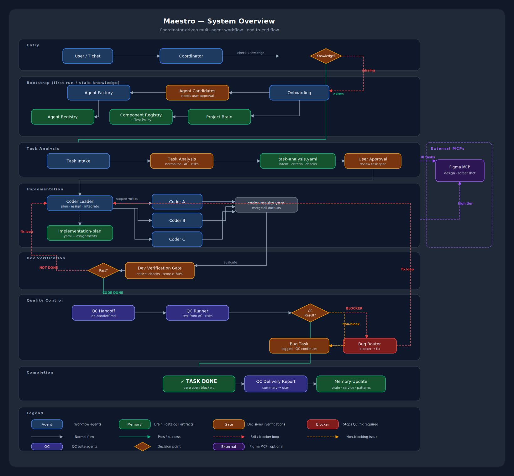
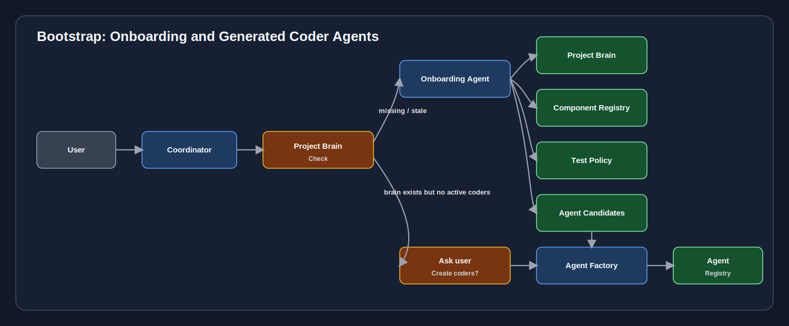
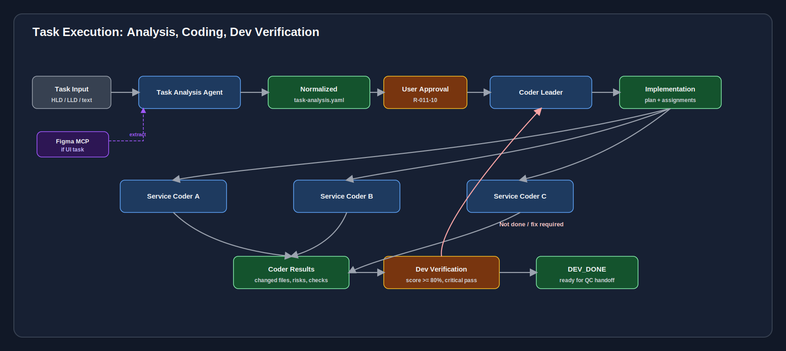
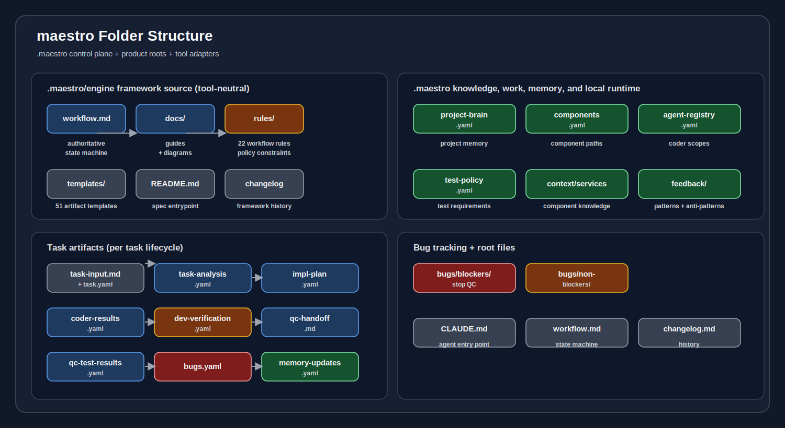

# Architecture Guide



This document describes the system architecture of the coordinator-driven multi-agent workflow.

## Design philosophy

The system follows a **coordinator-driven workflow** where no agent acts independently. Every task flows through a central coordinator that checks project state, routes to the right agent, enforces approval gates, and validates transitions.

Key architectural decisions:

```text
1. Coordinator-driven: one central router, no peer-to-peer agent communication
2. Project brain as memory: avoid rescanning the repository every conversation
3. Scoped coders: generated per service, never full-repo access
4. Task-first: no code before task analysis
5. Approval gates: destructive or scope-changing actions require user consent
6. Artifact contracts: every state transition requires specific artifacts
```

## System layers

```text
┌─────────────────────────────────────────────────────┐
│  User Layer                                         │
│  Natural language requests or /commands              │
└────────────────────┬────────────────────────────────┘
                     │
┌────────────────────▼────────────────────────────────┐
│  Routing Layer                                      │
│  Coordinator: routes, gates, state machine           │
│  Workflow Policy: validates transitions              │
└────────────────────┬────────────────────────────────┘
                     │
┌────────────────────▼────────────────────────────────┐
│  Knowledge Layer                                    │
│  Project Brain, Component Registry, Agent Registry      │
│  Test Policy, Component Knowledge, Feedback Patterns      │
└────────────────────┬────────────────────────────────┘
                     │
┌────────────────────▼────────────────────────────────┐
│  Execution Layer                                    │
│  Task Analysis → User Approval → Solution Architect  │
│  (when required) → Coder Leader → Service Coders     │
│  Dev Verification → QC Handoff → QC Runner           │
│  Bug Router → Memory Update                          │
└────────────────────┬────────────────────────────────┘
                     │
┌────────────────────▼────────────────────────────────┐
│  Artifact Layer                                     │
│  Tasks, Bugs, Handover docs, Memory updates          │
└─────────────────────────────────────────────────────┘
```

## Agent architecture

The system uses 12 fixed workflow agents plus unlimited generated service coders.

### Fixed agents (12)

These agents are defined once in `.claude/agents/` and are available to every project:

```text
Routing:      Coordinator, Workflow Policy
Knowledge:    Onboarding, Agent Factory, Memory Update
Execution:    Task Analysis, Solution Architect, Coder Leader, Dev Verification
QC:           QC Handoff, QC Runner, Bug Router
```

### Generated agents (unlimited)

Agent Factory creates **component-specific coder agents** after onboarding and user approval. Each generated coder is scoped to one registered component with explicit read, write, and forbidden paths.

```text
Example for an e-commerce project:
  coder-api.agent.md       → Backend NestJS service
  coder-web.agent.md       → Frontend React app
  coder-shared.agent.md    → Shared packages
```

See also: [agent-catalog.md](agent-catalog.md) for detailed agent descriptions.

## Knowledge architecture



The **project brain** is the central knowledge store. It is created by onboarding and maintained by memory update.

### Knowledge hierarchy

```text
.maestro/knowledge/
├── index.yaml              ← Read-first memory routing index
├── project.yaml      ← Workspace-wide facts: stack, architecture, conventions
├── architecture.md         ← Human-readable architecture notes
├── conventions.md          ← Coding conventions and reuse guidance
├── components.yaml    ← Service inventory and real source paths
├── agents.yaml     ← Built-in/generated coders with scopes
├── test-policy.yaml        ← Test requirements per service
├── skills.yaml     ← Installed skill selection metadata
├── model-routing.yaml      ← Agent model profile routing
├── agent-activity.yaml     ← Status dashboard and activity telemetry
├── response-ui.yaml        ← Response layout modes
├── workflow-state.yaml     ← Current workflow state
├── .maestro/knowledge/components/<component-id>.yaml ← Per-component deep intelligence
└── feedback/               ← Patterns and anti-patterns
```

### Knowledge lifecycle

```text
1. Onboarding scans `inputs/` and `services/<repo>/` → creates project brain
2. Task analysis reads brain → understands impacted services
3. Coder leader reads brain → selects correct coders
4. Service coders read component knowledge → follow conventions
5. Memory update writes brain → persists new learnings
```

### Freshness model

The coordinator checks project brain freshness before routing. If stale or missing:

```text
Missing → full onboarding
Stale (known area) → partial rescan
Fresh → proceed to task routing
```

## Execution architecture



### Task lifecycle

```text
1. Task Analysis    → Normalize input into structured spec
2. User Approval    → User reviews and approves task-analysis.yaml
3. Solution Architect → Review architecture when required
4. Coder Leader     → Create implementation plan, assign coders
5. Service Coders   → Implement within scoped boundaries
6. Dev Verification → Score ≥80% + critical checks = Code Done
7. QC Handoff       → Create mandatory handoff document
8. QC Runner        → Execute test cases from handoff
9. Bug Router       → Classify defects, route fixes
10. QC Delivery     → Write qc-delivery-report.md for user
11. Memory Update   → Persist durable learnings
```

### Cross-service coordination

Service coders cannot coordinate directly. All cross-service changes go through Coder Leader:

```text
Coder A needs change in Service B
  → Coder A raises cross_service_request
  → Coder Leader evaluates
  → Coder Leader assigns Coder B
  → Coder Leader validates integration
```

### Contract protection

Coder Leader protects shared contracts:

```text
API contracts      → endpoint signatures, request/response schemas
Event contracts    → event names, payloads, topics
Schema contracts   → database migrations, shared types
Package contracts  → shared library interfaces
```

## QC architecture


### Blocker vs non-blocker

```text
Blocker:
  Main flow blocked, crash, auth/security broken,
  data corruption risk, downstream QC cases blocked
  → Stop QC immediately → Coordinator → Coder Leader → fix → re-verify → retest

Non-blocker:
  Cosmetic, copy, layout, warning, rare edge case
  → QC continues on unaffected cases → optional parallel fix task
```

### QC completion

```text
QC_DONE requires:
  Zero open blocker bugs
  All test cases recorded in qc-test-results.yaml
```

## State machine


Valid task states and their transitions:

```text
NEW → NEED_ONBOARDING / READY_FOR_ANALYSIS
NEED_ONBOARDING → ONBOARDED → NEED_AGENT_CREATION_APPROVAL → AGENTS_READY
AGENTS_READY → READY_FOR_ANALYSIS → ANALYZED
ANALYZED → ARCHITECTURE_REVIEWING → PLANNED
ANALYZED → PLANNED
PLANNED → IN_DEV → DEV_VERIFYING
DEV_VERIFYING → DEV_DONE | DEV_BLOCKED | IN_DEV
DEV_BLOCKED → IN_DEV
DEV_DONE → QC_READY → QC_TESTING
QC_TESTING → QC_DONE | BLOCKED_BY_BUG
BLOCKED_BY_BUG → FIXING → DEV_VERIFYING
DEV_DONE → QC_RETESTING → QC_DONE
QC_DONE → MEMORY_SYNCING → DONE
```

Every transition requires specific artifacts. See rule R-012 (artifact contracts).

## Security architecture

```text
No real secrets in .maestro/runtime artifacts or tool adapter files (R-013)
Auth/security tasks require critical checks (R-013-05)
Security-sensitive blockers stop QC (R-013-06)
Generated coders cannot change auth behavior without leader approval (R-013-07)
Sensitive values redacted before writing artifacts
```

## File system architecture



See also: [folder-guide.md](folder-guide.md) for detailed folder descriptions.

```text
.maestro/engine/
├── workflow.md      ← End-to-end workflow policy
├── rules/           ← 23 workflow rules (constraints and governance)
├── templates/       ← 51 artifact templates
└── docs/            ← Documentation and visual diagrams

.maestro/runtime/
├── workflow-state.yaml
├── agent-activity.yaml
├── active-context.yaml
├── cache/           ← Local generated cache and hashes
├── locks/           ← Local execution locks
└── reports/         ← Generated status and health reports

.claude/
├── agents/         ← 12 workflow agents + built-in/generated coders
├── skills/         ← 231 skill definitions (12 workflow + 219 technical)
├── commands/       ← 17 workflow commands (user entry points)
└── settings.json    ← Claude Code settings

inputs/             ← User-provided reference docs scanned by onboarding
services/           ← Registered deployable product services, workers, and gateways
```

## Related documents

- [visual-flow.md](visual-flow.md) — All SVG workflow diagrams
- [agent-catalog.md](agent-catalog.md) — Detailed agent descriptions
- [workflow-reference.md](workflow-reference.md) — Workflow states and commands
- [skill-guide.md](skill-guide.md) — Skill system and composition
- [folder-guide.md](folder-guide.md) — Folder structure reference
- [deep-onboarding.md](deep-onboarding.md) — Deep onboarding standard
- [skill-composition.md](skill-composition.md) — Skill composition standard
