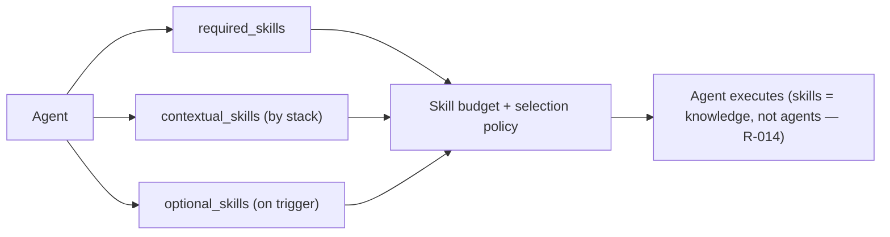

# Skill Composition Standard



This document defines how skills work in `.claude`.

## 1. Important correction

A skill is **not** the same thing as an agent.

```text
Agent = role, responsibility, permission, workflow ownership
Skill = reusable capability or procedure the agent can use
```

Therefore:

```text
One agent can have many skills.
One skill can be used by many agents.
A generated service coder can combine workflow skills + technical skills + quality skills.
```

## 2. Example

A `coder-payment-service` agent may need:

```text
Workflow skills:
- skill-service-coder
- skill-dev-verification
- skill-memory-update

Technical skills:
- skill-lang-typescript
- skill-framework-nestjs
- skill-database-prisma
- skill-api-rest

Quality skills:
- skill-security-hardening
- skill-testing-jest
- skill-observability-logging

Artifact skills:
- skill-qc-handoff
- skill-bug-routing
```

It is still one agent, but it uses many skills depending on task needs.

## 3. Skill types in agent contracts

Generated agents should declare skills like this:

```yaml
skills:
  required_skills:
    - skill-service-coder
  optional_skills:
    - skill-dev-verification
    - skill-memory-update
  contextual_skills:
    language: []
    framework: []
    database: []
    api: []
    testing: []
    security: []
    observability: []
```

## 4. Required skills

Required skills are always loaded for the agent's core responsibility.

Examples:

```text
Coordinator:
- skill-project-brain
- skill-workflow-policy

Onboarding:
- skill-project-onboarding
- skill-project-brain

Agent Factory:
- skill-agent-factory

Task Analysis:
- skill-task-analysis

Coder Leader:
- skill-coder-leader

Generated Service Coder:
- skill-service-coder

QC Runner:
- skill-qc-runner
- skill-bug-routing
```

## 5. Optional skills

Optional skills are loaded only when the task requires them.

Examples:

```text
Auth/password/token task -> security skill
Database schema task -> database/migration skill
Frontend UI task -> accessibility or UI skill
Payment task -> security + audit/logging skill
Performance issue -> performance/observability skill
API contract task -> REST/OpenAPI/gRPC/GraphQL skill
```

## 6. Contextual skills

Contextual skills come from Project Brain and Component Knowledge.

For example, onboarding detects:

```yaml
service: payment-service
stack:
  languages:
    - typescript
  frameworks:
    - nestjs
  databases:
    - postgresql
  orm:
    - prisma
  api_styles:
    - rest
  test_frameworks:
    - jest
```

Then Agent Factory should generate coder skills:

```yaml
contextual_skills:
  language:
    - skill-lang-typescript
  framework:
    - skill-framework-nestjs
  database:
    - skill-database-postgresql
    - skill-database-prisma
  api:
    - skill-api-rest
  testing:
    - skill-testing-jest
```

If those technical skills do not exist locally, keep them as desired capability names or omit them with a note. Do not invent detailed instructions without evidence.

## 7. Skill selection flow

```text
1. Task Analysis identifies intent, impacted services, risks, and critical checks.
2. Coder Leader checks impacted component knowledge files.
3. Coder Leader selects generated coders.
4. Each coder uses required_skills from its agent contract.
5. Each coder adds contextual_skills from component stack.
6. Each coder adds optional_skills based on task risks.
7. Skills used are recorded in coder-results.yaml or task-analysis.yaml.
```

## 8. Skill loading policy

Do not load every possible skill.

Runtime agents must not scan or read all of `.claude/skills/**`. Start with `.maestro/registry/skills.yaml`, select the smallest useful set, then open only the chosen skill's `SKILL.md` and directly referenced files.

Use this priority:

```text
1. Required workflow skill for the active command
2. Service stack skill directly needed by the code area
3. Risk skill required by task critical checks
4. Artifact skill needed by the current output
```

Avoid loading:

```text
Framework skills for frameworks not used by the service
Testing skills when component policy forbids test creation, unless needed for reading existing tests
Security skills for non-security tasks with no sensitive impact
Large reference-heavy skills unless task needs them
```

## 9. Skill conflict resolution

If skills conflict:

```text
workflow.md wins on state machine
rules/ wins on policy
.maestro/knowledge/components/<component-id>.yaml wins on component facts
.maestro/registry/agents.yaml wins on permissions
user approval wins on gated exceptions
task-analysis.yaml wins on task-specific acceptance criteria
```

Skills can guide implementation, but they cannot override:

```text
allowed_write_paths
forbidden_paths
approval gates
test policy
QC blocker stop rule
secret handling rules
```

## 10. Generated coder contract requirement

Every generated coder should include:

```yaml
skills:
  required_skills: []
  optional_skills: []
  contextual_skills:
    language: []
    framework: []
    database: []
    api: []
    testing: []
    security: []
    observability: []
  skill_selection_policy:
    load_required_for_primary_command: true
    load_contextual_when_task_touches_stack: true
    load_optional_when_risk_or_artifact_requires: true
    never_override_rules_or_permissions: true
```

## Related

- [visual-flow.md](visual-flow.md) — All workflow diagrams including skill composition
- [deep-onboarding.md](deep-onboarding.md) — How onboarding discovers skills for coder agents
- [external-skills.md](external-skills.md) — Registry of installed external skills
- [folder-guide.md](folder-guide.md) — Full `.claude` folder reference

```

## 11. Installed external skill registry

The currently installed skills from skills.sh are documented in [external-skills.md](external-skills.md).

Use `/skills status`, `/skills audit`, `/skills update <skill>`, and `/skills refresh-registry` for maintenance. Do not update skill folders, `skills-lock.json`, or risk metadata from onboarding, coder generation, or implementation commands.
```
