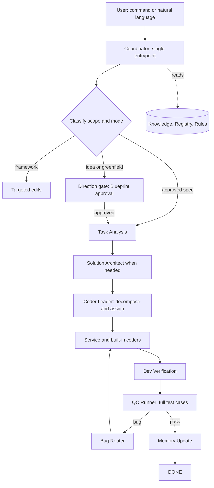
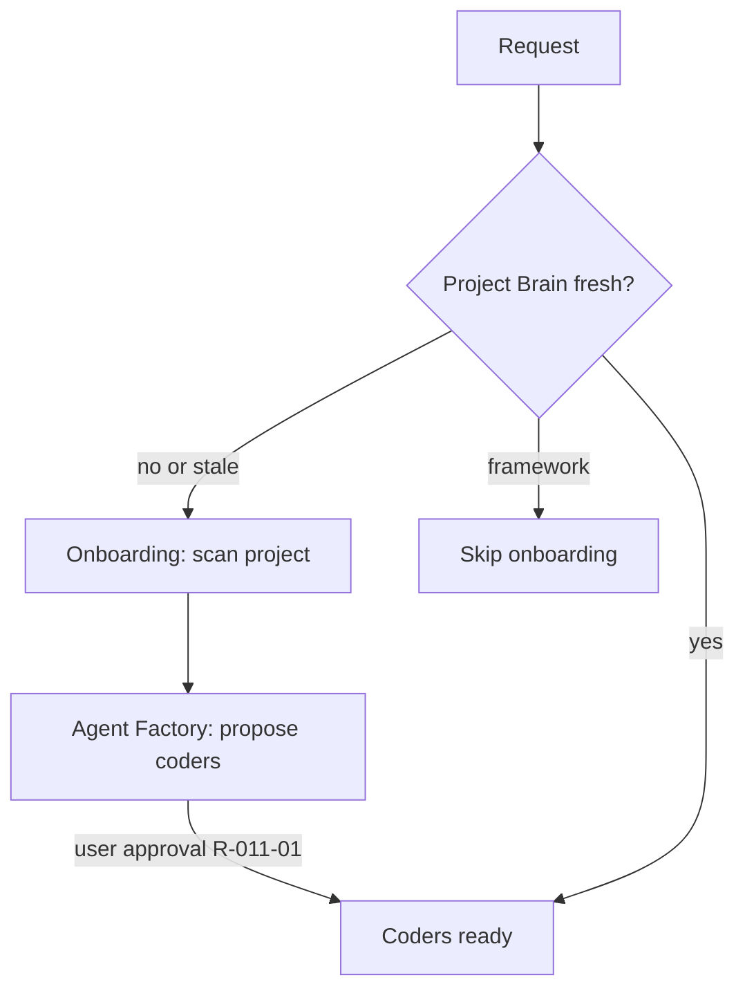
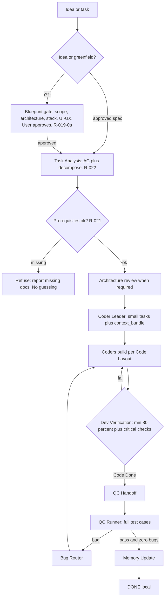
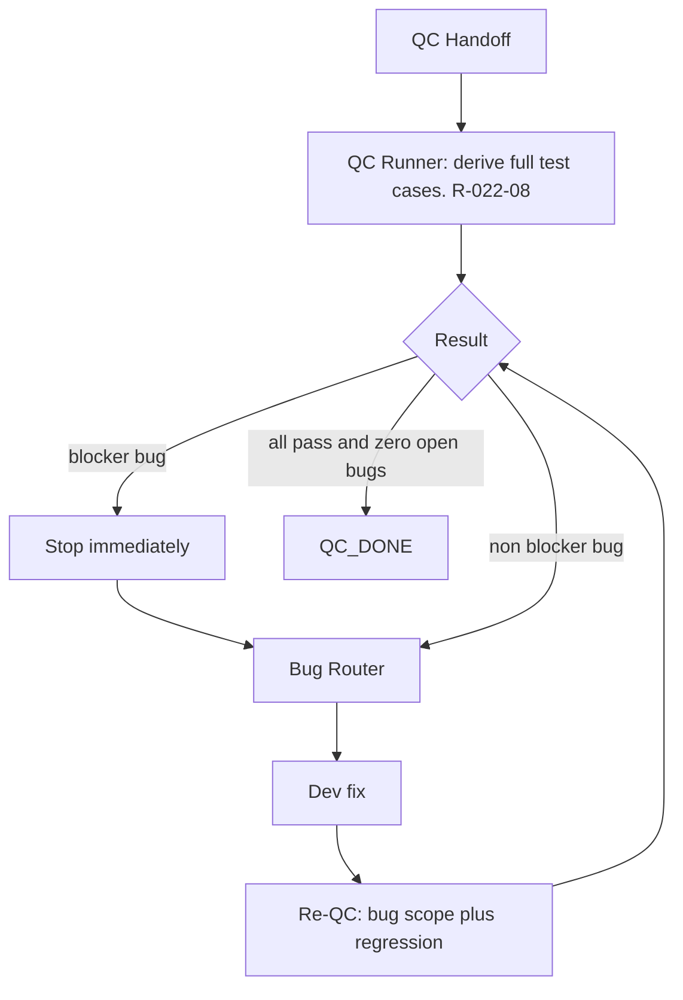
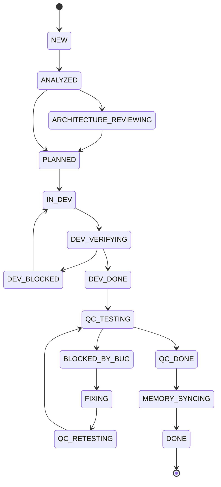
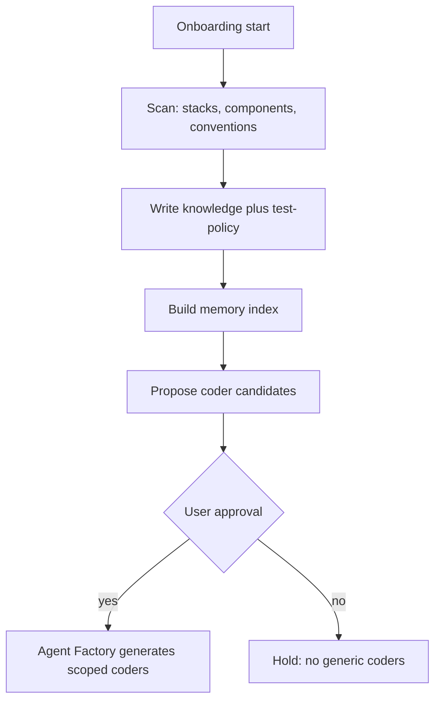
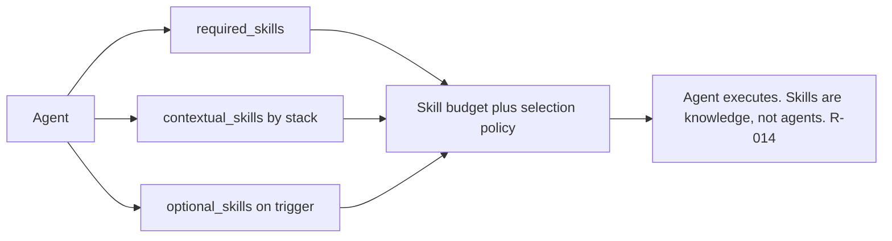
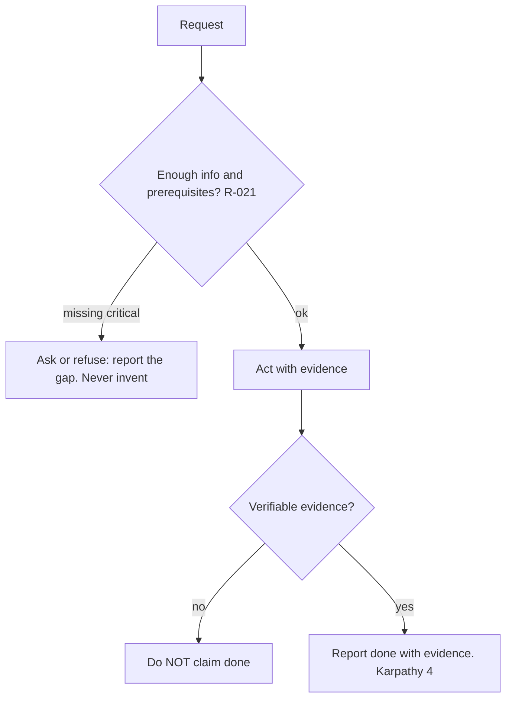
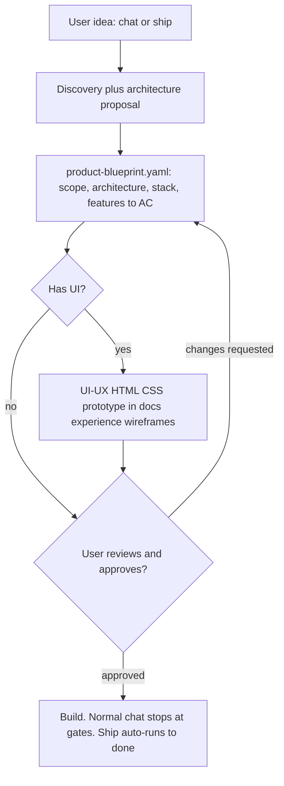
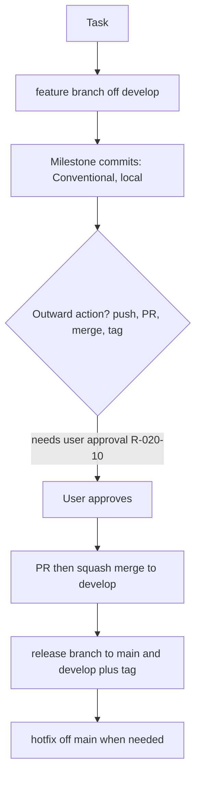

# Visual Workflow

Flow diagrams for Maestro, written in **Mermaid** (text) so both humans and AI agents can read and
update them. They reflect the current architecture: Direction gate, prerequisites, decomposition,
real-user QC, Git-flow.

> Rendering: GitHub and most viewers render Mermaid natively. **VS Code's built-in Markdown
> preview does NOT** — install the "Markdown Preview Mermaid Support" extension, or view the file on
> GitHub.

## 1. System overview

## 2. Bootstrap: onboarding and coder creation

## 3. Task execution: full pipeline

## 4. QC and bug routing

## 5. State machine

## 6. Deep onboarding

## 7. Skill composition

## 8. Principle flow: evidence and refusal

## 9. Direction gate: idea to approved blueprint

## 10. Git-flow

> Folder layout is documented as a text tree in `folder-guide.md` and the workspace layout section of
> `CLAUDE.md` (a tree is clearer than a diagram for directories).
