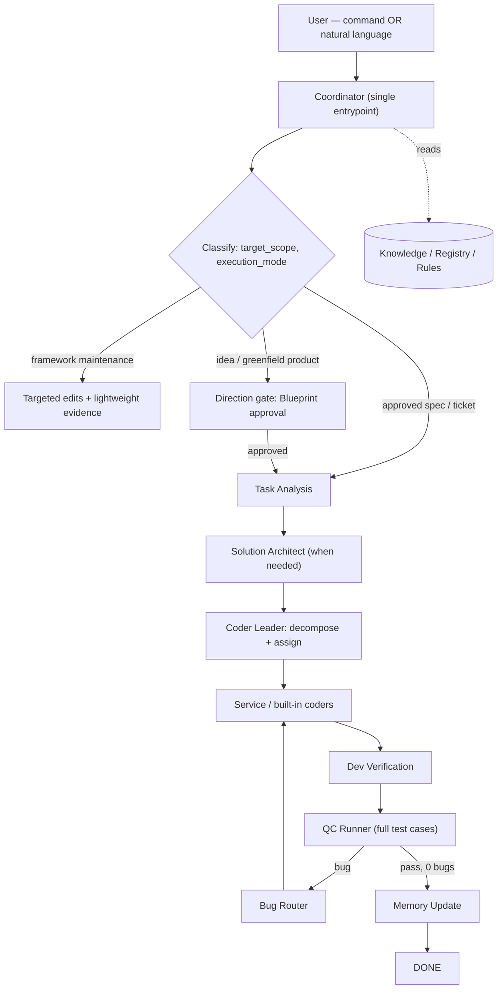
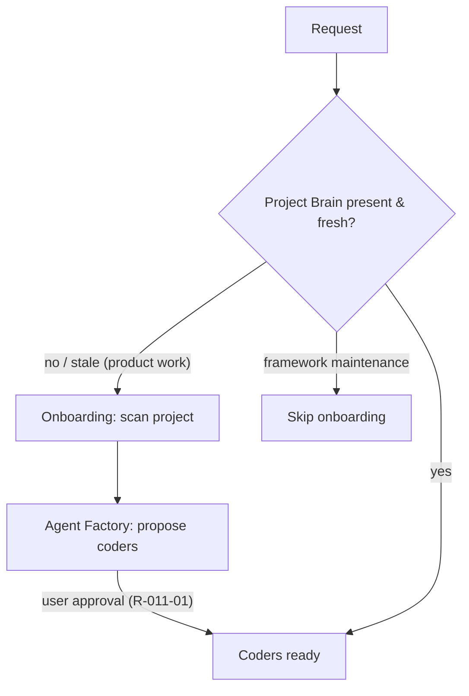
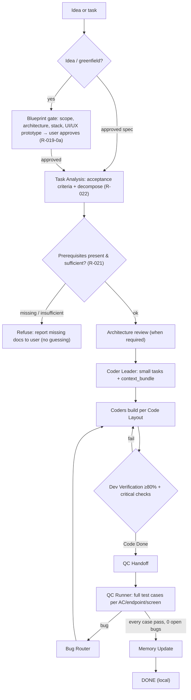
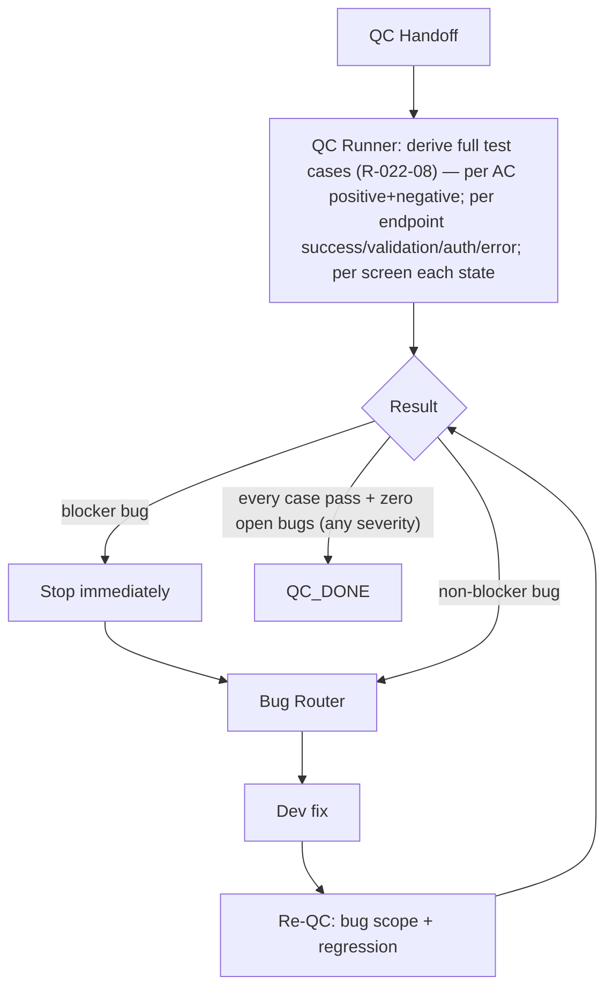
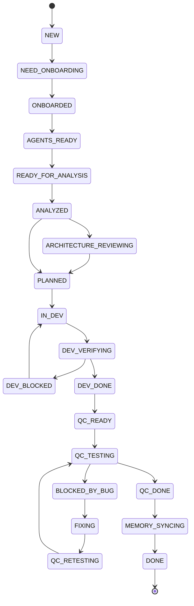
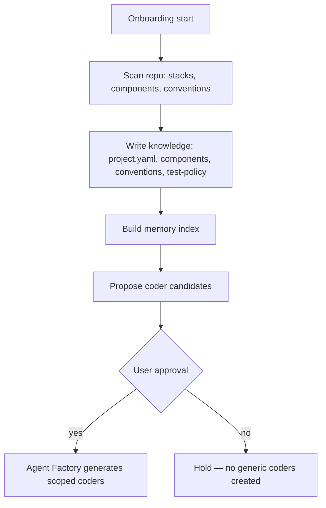
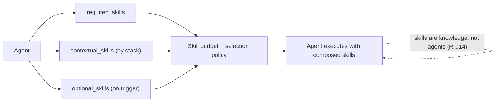
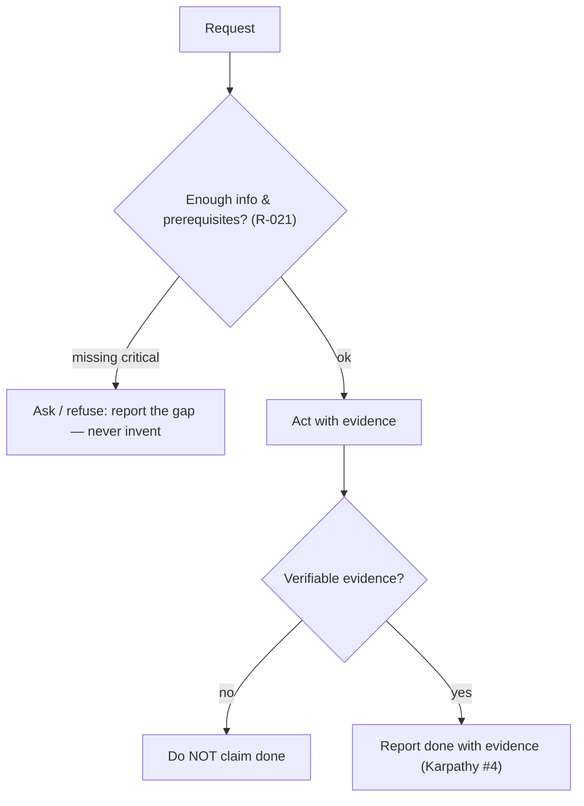
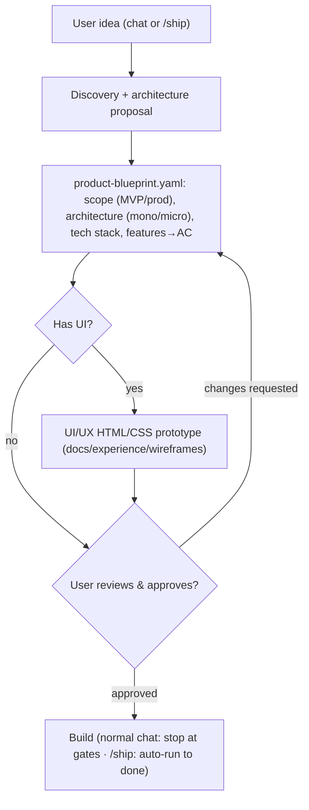
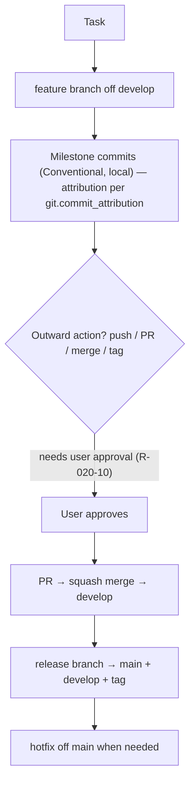

# Visual Workflow

Flow diagrams for Maestro, written in **Mermaid** (text) so both humans and AI agents can read and
update them. They render in GitHub, Kiro, VS Code, and most Markdown viewers. These reflect the current
architecture (Direction gate, prerequisites, decomposition, real-user QC, Git-flow).

## 1. System overview

## 2. Bootstrap — onboarding and coder creation

## 3. Task execution — full pipeline

## 4. QC and bug routing

## 5. State machine

## 6. Deep onboarding

## 7. Skill composition

## 8. Principle flow — evidence & refusal

## 9. Direction gate (idea → approved blueprint)

## 10. Git-flow

> Folder layout is documented as a text tree in `folder-guide.md` and the workspace layout section of
> `CLAUDE.md` (a tree is clearer than a diagram for directories).
