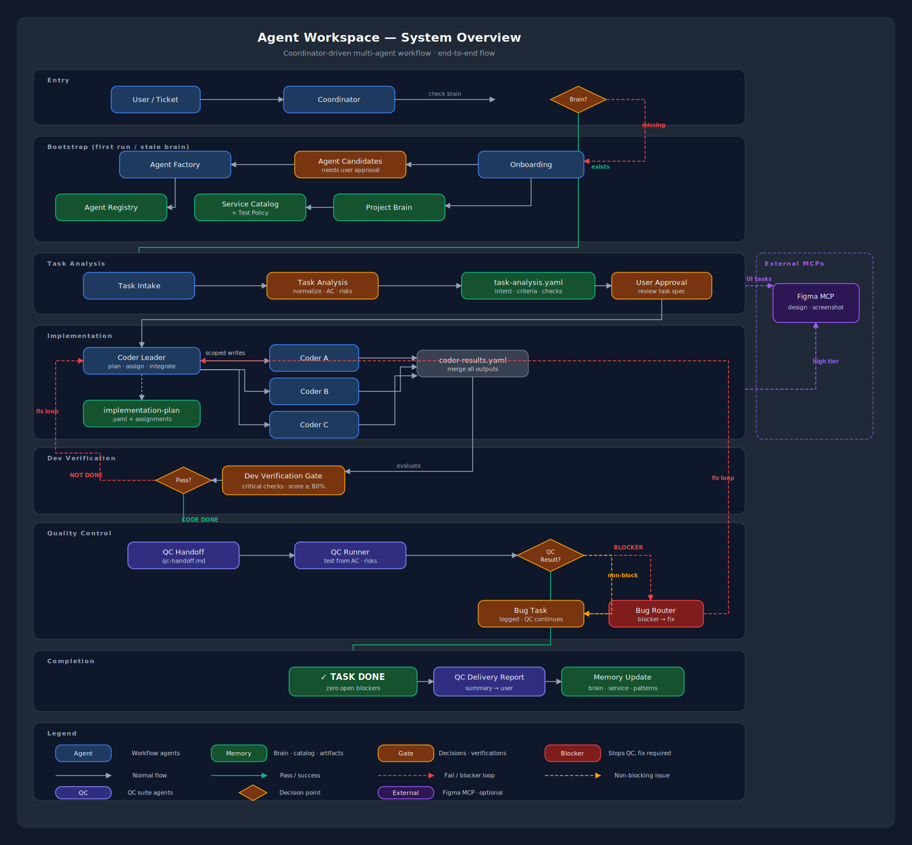

# agent-workspace

[](LICENSE)
[](#12-workflow-agents)
[](#231-skills)
[](https://github.com/ryan-nguyen-01/agent-workspace)

> **Cách viết tài liệu**: Phần giải thích cho người đọc dùng tiếng Việt, viết như ghi chú của maintainer cho team dùng thật. Giữ nguyên tiếng Anh cho command, file path, agent id, model profile, workflow state, rule id, skill name, YAML key, tên tool, và thuật ngữ AI/tooling đóng vai trò contract. Tránh văn phong quảng cáo, tránh câu kiểu AI tạo sẵn, và không dịch các contract term mà tool cần đọc chính xác.

`agent-workspace` là workspace để điều phối AI coding tools theo một quy trình cố định. Nó giữ Project Brain, rule, command, agent contract, task artifact và feedback memory ở một chỗ, để mỗi lần làm việc không phải bắt đầu lại từ đầu.

## Điểm vào tài liệu

| Bạn cần | Đọc file |
| --- | --- |
| Khởi tạo workspace điều phối nhanh | [QUICKSTART.md](QUICKSTART.md) |
| Danh sách slash command | [COMMAND.md](COMMAND.md) |
| Hiểu tổng quan framework | [README.md](README.md) |
| Cài đặt, upgrade, validation chi tiết | [SETUP.md](SETUP.md) |
| Entry point cho AI agent không phải Claude | [AGENTS.md](AGENTS.md) |
| Entry point cho Claude Code | [CLAUDE.md](CLAUDE.md) |
| Entry point cho Codex | [.codex/AGENTS.md](.codex/AGENTS.md) |
| Entry point cho Cursor | [.cursor/rules/agent-workspace.mdc](.cursor/rules/agent-workspace.mdc) |
| Entry point cho Gemini | [.gemini/GEMINI.md](.gemini/GEMINI.md) |
| Nguồn chuẩn của workflow | [.agent/workflow.md](.agent/workflow.md) |
| Phân biệt workflow/built-in/generated agents | [.agent/docs/agent-taxonomy.md](.agent/docs/agent-taxonomy.md) |

---

## Vì sao cần workspace này

### Vấn đề với AI viết code hiện tại

Khi dùng Claude, Codex, Cursor, Copilot hoặc các AI coding tool khác trong một codebase thật, các lỗi sau rất dễ lặp lại:

- Mỗi conversation thường bắt đầu như một context mới. Những quyết định cũ, quy ước code và lỗi đã gặp dễ bị quên.
- AI có thể nhảy thẳng vào sửa code trước khi phân tích yêu cầu, phạm vi ảnh hưởng hoặc test policy.
- Nếu không có write scope rõ ràng, AI có thể sửa file ngoài phạm vi task.
- Không phải lúc nào cũng có bước kiểm tra trước khi kết luận "xong".
- Feedback sau bug hoặc review thường không được ghi lại để lần sau tránh lặp.

### Giải pháp: Workflow do coordinator điều phối

Workspace này thêm một lớp điều phối trước khi AI sửa code:

| Vấn đề                 | Giải pháp                                                                                       |
| ---------------------- | ----------------------------------------------------------------------------------------------- |
| AI không nhớ context   | **Project Brain** lưu lại thông tin bền vững của project                                        |
| AI không có quy trình  | **12 workflow agents** chia rõ trách nhiệm từng bước                                             |
| AI không biết giới hạn | **Generated service coders** với `allowed_write_paths` và `forbidden_paths` giới hạn theo service |
| Không có quality gate  | **Dev Verification** và **QC Runner** tạo điểm kiểm tra trước khi giao                          |
| Không học từ sai lầm   | **Memory Update** ghi lại pattern, anti-pattern và bug root cause                                |
| Context quá lớn / tốn token | **Context economy** dùng index, context hints và task `context_plan` để giới hạn file cần đọc |

### Mục tiêu thiết kế

```
Không tối ưu cho demo nhanh.
Tối ưu cho việc dùng AI trong codebase cần kiểm soát, review và audit.
```

Nếu bạn chỉ cần thử ý tưởng nhỏ, repo này có thể hơi nặng. Nó phù hợp hơn khi team muốn AI làm việc có scope, có evidence, có bước verify và có memory để lần sau không lặp lại cùng lỗi.

---

## Kiến trúc hệ thống



> Chi tiết tất cả sơ đồ workflow: [visual-flow.md](.agent/docs/visual-flow.md)

---

## Thống kê

| Hạng mục         | Số lượng                          |
| ---------------- | --------------------------------- |
| Agent workflow   | 12                                |
| Skills           | 231 (12 workflow + 219 technical) |
| Rules            | 16                                |
| Template         | 20                                |
| Command          | 16                                |
| Built-in coders  | 2 cross-cutting coders            |
| Agent sinh tự động | Tạo theo service sau onboarding  |

---

## Cấu trúc thư mục

```
agent-workspace/
├── CLAUDE.md                          ← Entry point (Claude đọc file này đầu tiên)
├── AGENTS.md                          ← Entry point chung cho AI coding agents
├── COMMAND.md                         ← Slash command index
├── GUIDELINES.md                      ← Cách dùng nhanh + semantics
├── SETUP.md                           ← Hướng dẫn cài đặt chi tiết
├── README.md                          ← File này
├── .codex/                            ← Codex-specific instructions
├── .cursor/                           ← Cursor rules
├── .gemini/                           ← Gemini-specific instructions
├── .agent/                            ← Tool-neutral workflow source
│   ├── workflow.md                    ← End-to-end workflow policy
│   ├── rules/                         ← 16 workflow rules (00-15)
│   ├── templates/                     ← 20 artifact templates
│   └── docs/                          ← Tài liệu + sơ đồ trực quan
├── .runtime/                          ← Runtime memory, task artifacts, bug records
│   ├── context/                       ← Project brain, service contracts, workflow state
│   ├── tasks/                         ← Per-task artifacts
│   └── bugs/                          ← Bug tracking
├── .claude/                           ← Claude adapter
│   ├── agents/                        ← 12 workflow agents + built-in/generated coders
│   │   ├── coordinator.agent.md
│   │   ├── onboarding.agent.md
│   │   ├── agent-factory.agent.md
│   │   ├── task-analysis.agent.md
│   │   ├── solution-architect.agent.md
│   │   ├── coder-leader.agent.md
│   │   ├── dev-verification.agent.md
│   │   ├── qc-handoff.agent.md
│   │   ├── qc-runner.agent.md
│   │   ├── bug-router.agent.md
│   │   ├── memory-update.agent.md
│   │   └── workflow-policy.agent.md
│   │
│   ├── skills/                        ← 231 skill definitions
│   │   ├── skill-project-brain/SKILL.md
│   │   ├── skill-task-analysis/SKILL.md
│   │   ├── react/SKILL.md
│   │   ├── docker/SKILL.md
│   │   └── ... (231 skills)
│   │
│   ├── commands/                      ← 16 workflow commands
│   │   ├── onboard.md
│   │   ├── analyze-task.md
│   │   ├── dev.md
│   │   └── ...
│   │
│   └── settings.json                  ← Claude Code settings
├── inputs/                            ← USER drops reference docs (PRD/HLD/ADR/OpenAPI/glossary/runbooks)
│   ├── README.md                      ← Convention guide
│   ├── product/                       PRD, business specs, user stories
│   ├── architecture/                  HLD, LLD, ADRs, system diagrams
│   ├── api/                           OpenAPI/Swagger specs, contracts
│   ├── domain/                        Domain models, glossary, business rules
│   ├── runbooks/                      Ops playbooks, incident response
│   └── misc/                          Uncategorized
├── services/                          ← Local empty/ignored workspace for cloned service repos
```

---

## 12 Agent Trong Workflow

| Agent                | Model profile  | File                      | Vai trò                                                                      |
| -------------------- | -------------- | ------------------------- | ---------------------------------------------------------------------------- |
| **Coordinator**      | fast_router    | coordinator.agent.md      | Router trung tâm: route task, kiểm tra Project Brain, enforce approval gate |
| **Onboarding**       | deep_reasoning | onboarding.agent.md       | Quét project, tạo Project Brain, service catalog, test policy                |
| **Agent Factory**    | coding_planner | agent-factory.agent.md    | Tạo coder agent theo service sau khi có user approval                        |
| **Task Analysis**    | deep_reasoning | task-analysis.agent.md    | Chuẩn hóa HLD/LLD/ticket/bug thành task spec có cấu trúc                    |
| **Solution Architect** | deep_reasoning | solution-architect.agent.md | Review rủi ro kiến trúc cross-service/API/data/event/security/infra trước khi planning |
| **Coder Leader**     | coding_planner | coder-leader.agent.md     | Điều phối generated service coders: plan, assign, tích hợp, review architecture/code quality |
| **Dev Verification** | verification   | dev-verification.agent.md | Gate sẵn sàng output: critical checks, runtime evidence, test policy, score ≥80% |
| **QC Handoff**       | fast_router    | qc-handoff.agent.md       | Tạo tài liệu bàn giao Dev-to-QC bắt buộc sau Code Done                       |
| **QC Runner**        | verification   | qc-runner.agent.md        | Chạy QC test từ handoff, dừng khi có blocker bug                             |
| **Bug Router**       | deep_reasoning | bug-router.agent.md       | Phân loại defect thành blocker/non-blocker và route hướng fix                |
| **Memory Update**    | memory_light   | memory-update.agent.md    | Lưu durable learnings sau các workflow event có ý nghĩa                      |
| **Workflow Policy**  | deep_reasoning | workflow-policy.agent.md  | Kiểm tra state transition, approval gate, và tuân thủ policy                 |

Model defaults live in `.runtime/context/model-routing.yaml`: Claude deep reasoning uses Opus, Claude coding uses Sonnet; Codex deep reasoning uses GPT-5.5, Codex coding uses the configured Codex coding model (`gpt-5.3-codex` by default).

Muốn switch model, chỉnh `.runtime/context/model-routing.yaml.model_overrides` thay vì sửa agent files hoặc xóa stable model profiles. Override hợp lệ giữ nguyên profile contract (`deep_reasoning`, `coding`, `fast`) và thêm `reason` khi policy yêu cầu.

---

## Workflow chính

### Luồng 1: Onboarding (dự án mới / chưa có memory)

```
User mở project → gõ task bất kỳ
  │
  ├─ coordinator        → Phát hiện chưa có project brain
  ├─ onboarding         → Quét cấu trúc repo, nhận diện stack, tạo Project Brain
  ├─ agent-factory      → Đề xuất coder agents (cần user approval)
  │
  └─ Sẵn sàng → coordinator xử lý task tiếp theo
```

### Luồng 2: Implement tính năng (workflow đầy đủ)

```
User: "Thêm tính năng login bằng Google OAuth"
  │
  ├─ 1. coordinator     → Xác định hướng xử lý và gate cần qua
  ├─ 2. task-analysis   → Chuẩn hóa yêu cầu vào task-analysis.yaml
  ├─ 3. solution-architect → Review kiến trúc nếu task có rủi ro
  ├─ 4. coder-leader    → Lập plan và chia việc cho service coders
  ├─ 5. [service coders]→ Sửa code trong phạm vi được phép
  ├─ 6. coder-leader    → Review lại kiến trúc và chất lượng code
  ├─ 7. dev-verification→ Kiểm tra evidence, critical checks và test policy
  ├─ 8. qc-handoff      → Tạo tài liệu bàn giao sang QC
  ├─ 9. qc-runner       → Chạy QC theo handoff
  ├─ 10. bug-router     → Route bug nếu QC phát hiện lỗi
  ├─ 11. memory-update  → Lưu bài học cần dùng lại
  │
  └─ DONE
```

### Luồng 3: Vòng lặp fix bug

```
QC Runner phát hiện bug
  │
  ├─ bug-router         → Phân loại: blocker / non-blocker
  │  ├─ Blocker         → Dừng QC và route lại coder-leader
  │  └─ Non-blocker     → QC tiếp tục ở các case không bị ảnh hưởng
  │
  ├─ coder-leader       → Giao phần fix và review lại
  ├─ dev-verification   → Verify lại output
  ├─ qc-runner          → Retest
  │
  └─ Hết blocker → memory-update
```

---

## Service Coder Sinh Tự Động

`agent-factory` tạo coder agents riêng cho từng service sau khi onboarding hoàn tất và user approve.

`coder-infra` và `coder-database` là **built-in cross-cutting coders** được ship sẵn với framework. Chúng không phải generated service coders từ onboarding; chúng chỉ được Coder Leader dùng khi task có scope hạ tầng hoặc database phù hợp.

### Đặc điểm

- Mỗi coder có **allowed_read_paths**, **allowed_write_paths**, **forbidden_paths**
- Mỗi coder có **test_policy** và **escalation rules**
- Không tạo full-repo coders — mỗi coder chỉ cover 1 service
- Scope expansion cần user approval

### Quy ước đặt tên

```
coder-<service-slug>.agent.md
```

### Ví dụ: Project e-commerce

```
Phát hiện stack: NestJS + React + PostgreSQL + Redis

Được tạo:
  coder-api.agent.md          ← Backend API service
  coder-web.agent.md          ← Frontend React app
  coder-shared.agent.md       ← Shared packages
```

---

## 16 Quy Tắc Workflow

Các rule tại `.agent/rules/` định nghĩa constraint và governance cho workflow:

| Rule  | File                          | Mô tả                                                 |
| ----- | ----------------------------- | ----------------------------------------------------- |
| R-000 | 00-core-rules.md              | Đọc workflow trước; không code khi chưa có analysis   |
| R-001 | 01-project-brain-rules.md     | Project Brain là nguồn memory chính                   |
| R-002 | 02-onboarding-rules.md        | Onboarding chỉ quét, không sửa code                   |
| R-003 | 03-agent-factory-rules.md     | Tạo agent cần user approval                           |
| R-004 | 04-task-analysis-rules.md     | Task phải được chuẩn hóa trước khi code               |
| R-005 | 05-coder-leader-rules.md      | Điều phối khi task ảnh hưởng nhiều service            |
| R-006 | 06-service-coder-rules.md     | Service coder chỉ write trong scope được phép         |
| R-007 | 07-dev-verification-rules.md  | Code Done cần score và critical checks                |
| R-008 | 08-qc-rules.md                | QC chạy sau handoff và dừng khi có blocker            |
| R-009 | 09-bug-routing-rules.md       | Phân loại blocker / non-blocker                       |
| R-010 | 10-memory-rules.md            | Khi nào và cách nào lưu memory                        |
| R-011 | 11-approval-gates.md          | Các hành động cần user approval                       |
| R-012 | 12-artifact-contracts.md      | Artifact bắt buộc theo từng workflow state            |
| R-013 | 13-security-secret-rules.md   | Không ghi secret thật vào artifact                    |
| R-014 | 14-skill-composition-rules.md | Skill là capability, không phải identity của agent    |

---

## 231 Skill

### 12 Workflow Skill (prefix `skill-*`)

| Skill                    | Mô tả                                   |
| ------------------------ | --------------------------------------- |
| skill-project-brain      | Quản lý Project Brain dùng lại nhiều lần |
| skill-project-onboarding | Tạo Project Brain từ lần quét ban đầu   |
| skill-agent-factory      | Tạo coder agent theo từng service       |
| skill-task-analysis      | Chuẩn hóa yêu cầu thành task spec       |
| skill-coder-leader       | Điều phối các service coder             |
| skill-service-coder      | Sửa code trong scope được phép          |
| skill-dev-verification   | Đánh giá trạng thái Code Done           |
| skill-qc-handoff         | Tạo tài liệu handoff sang QC            |
| skill-qc-runner          | Chạy QC và ghi kết quả test             |
| skill-bug-routing        | Phân loại và route defect               |
| skill-memory-update      | Lưu các bài học cần dùng lại            |
| skill-workflow-policy    | Kiểm tra transition và gate             |

### 219 Skill kỹ thuật

| Category            | Ví dụ skills                                                                      |
| ------------------- | --------------------------------------------------------------------------------- |
| Frontend Frameworks | react, angular, vue, svelte, next-best-practices, astro                           |
| Backend Frameworks  | fastapi-python, nestjs-clean-typescript, java-spring-development, ruby-rails      |
| Databases & ORM     | postgresql-best-practices, prisma, drizzle-orm, supabase, redis-best-practices    |
| Mobile              | flutter, building-native-ui, expo-\*, android-development                         |
| Cloud & DevOps      | aws-cloud-services, docker, cloudformation, lambda, azure-kubernetes              |
| Testing             | playwright-best-practices, python-testing, rspec                                  |
| Go Language         | go-concurrency, go-testing, go-error-handling, golang-pro                         |
| CSS & Styling       | tailwindcss, scss-best-practices, styled-components-best-practices, shadcn        |
| Architecture        | api-design-principles, microservices, loom-event-driven, cloud-solution-architect |
| State Management    | redux-toolkit, zustand-state-management, react-query                              |
| Payment             | stripe-best-practices, payment-integration, paypal-integration                    |
| Knowledge Patches   | \*-knowledge-patch (latest framework/library updates)                             |

---

## 16 Slash Command

| Command        | File             | Mô tả                      |
| -------------- | ---------------- | -------------------------- |
| /onboard       | onboard.md       | Tạo hoặc refresh memory và service contract |
| /analyze-task  | analyze-task.md  | Chuẩn hóa task thành spec  |
| /create-coders | create-coders.md | Tạo service coder agents   |
| /plan-dev      | plan-dev.md      | Lên plan implementation    |
| /dev           | dev.md           | Implement code             |
| /verify-dev    | verify-dev.md    | Kiểm tra trạng thái Code Done |
| /handoff-qc    | handoff-qc.md    | Tạo tài liệu handoff sang QC |
| /qc            | qc.md            | Chạy QC test               |
| /bug           | bug.md           | Route bug report           |
| /sync-memory   | sync-memory.md   | Cập nhật memory            |
| /skills        | skills.md        | Bảo trì skills đã cài      |
| /workspace-mode | workspace-mode.md | Chuyển hoặc sửa workspace mode |
| /policy-check  | policy-check.md  | Kiểm tra workflow policy   |
| /coord         | coord.md         | Gọi coordinator trực tiếp  |
| /status        | status.md        | Xem workflow và activity dashboard |
| /resume-task   | resume-task.md   | Tiếp tục task bị gián đoạn |

---

## Memory Và Service

Runtime được gom dưới `.runtime` để tách khỏi adapter của từng tool và không lẫn với source service:

```text
.runtime/context/  ← bộ não bền vững, service contracts, workflow state, model routing, activity dashboard, response UI
.runtime/tasks/    ← artifact theo task
.runtime/bugs/     ← bug blocker/non-blocker
services/         ← workspace rỗng/ignored để clone source service; không cần file scaffold bên trong
```

Agent không đọc toàn bộ memory mỗi lần. Nó đọc `.runtime/context/index.yaml` trước, dùng `project_profile`, service `profile.context_hints`, và task `context_plan`, rồi chỉ mở các file liên quan đến task/service đang xử lý.

`/status` hiển thị dashboard từ `.runtime/context/agent-activity.yaml`: agent nào đang chạy, đang làm gì, model profile/model id khi biết, elapsed/ETA, token budget, token usage và cost nếu tool expose metrics. Nếu không có số liệu thật, status phải hiển thị `unknown` hoặc `estimated`, không bịa số chính xác.

Response layout cho Claude/Codex/Cursor/Gemini/Copilot nằm trong `.runtime/context/response-ui.yaml`: compact, concise, dashboard, models, dev, review, policy. File này điều khiển cấu trúc markdown/text và line budget, không điều khiển native panel UI của từng tool.

Với tool không expose project slash command, dùng CLI mirror:

```bash
python3 scripts/status-dashboard.py --mode <compact|concise|dashboard|models|json>
python3 scripts/status-dashboard.py --mode dashboard --write
python3 scripts/agent-activity.py start --agent-id coordinator --phase routing --current-action "Classifying request"
python3 scripts/architecture-health-check.py --strict --write-report
```

`status-dashboard.py --write` tạo `.runtime/status.md` và `.runtime/status.html` từ cùng nguồn dữ liệu status; HTML dùng style `github-readme-card` với tab bar, hero banner, metric cards, và raw status audit block. Đây là artifact đọc lại, không phải source of truth. `agent-activity.py` giúp adapter cập nhật activity/heartbeat mà không bịa token/cost. `architecture-health-check.py` là safety net deterministic cho drift counts/model/UI/entrypoint; nó không thay thế `/policy-check`.

Memory tự động tạo bởi onboarding, duy trì bởi memory-update:

```
.runtime/context/
├── index.yaml                ← Routing index để tránh đọc toàn bộ memory
├── project-brain.yaml        ← Project memory
├── architecture.md           ← Architecture/flow notes
├── conventions.md            ← Coding conventions
├── common/generics.md        ← Reusable asset index
├── services/<service>.yaml   ← Per-service brain files
└── feedback/
    ├── inbox.md              ← Raw user/team feedback
    ├── patterns.md           ← Good patterns to reuse
    └── anti-patterns.md      ← Mistakes to avoid
```

Service control plane cũng nằm trong `.runtime/context`, không nằm trong `services/`:

```
.runtime/context/
├── service-catalog.yaml      ← service.path, boundaries, coder candidates
├── agent-registry.yaml       ← Active generated coders
├── test-policy.yaml          ← Test requirements per service
└── skill-registry.yaml       ← Skill selection registry
```

Khởi tạo memory: `/onboard <service-path>`.

Sau khi có cập nhật: dùng `/sync-memory --files <paths> --services <service-ids>` cho thay đổi nhỏ, hoặc `/onboard --refresh <service>` khi cấu trúc service/test policy thay đổi.

---

## Artifact Theo Task (.runtime/tasks/)

Mỗi task có một folder riêng trong `.runtime/tasks/`. Folder này lưu input, analysis, plan, kết quả verify, QC và memory update của task đó.

```
.runtime/tasks/<task_id>/              ← TASK-YYYYMMDD-NNN-slug
├── task-input.md             ← Nội dung user gửi ban đầu
├── task.yaml                 ← Manifest của task và đường dẫn artifact
├── task-updates.yaml         ← Log cập nhật theo thời gian
├── task-analysis.yaml        ← Task spec đã được chuẩn hóa
├── architecture-review.yaml  ← Gate kiến trúc khi cần
├── implementation-plan.yaml  ← Plan của coder-leader
├── service-assignments.yaml  ← Coder nào xử lý phần nào
├── coder-results.yaml        ← Kết quả từ các coder
├── dev-verification.yaml     ← Kết quả đánh giá Code Done
├── qc-handoff.md             ← Handoff sang QC
├── qc-test-results.yaml      ← Kết quả QC
├── bugs.yaml                 ← Index bug của task
└── memory-updates.yaml       ← Bài học cần lưu lại
```

---

## Ma Trận Hỗ Trợ

### Sẵn sàng theo quy mô

| Quy mô                 | Hỗ trợ        |
| ---------------------- | ------------- |
| MVP (< 100 users)      | Phù hợp nếu muốn giữ workflow rõ ràng |
| Startup (100-1K users) | Phù hợp cho team nhỏ dùng AI hằng ngày |
| Growth (1K-10K users)  | Phù hợp khi cần kiểm soát scope và QC |
| Scale (10K+ users)     | Dùng được, nhưng nên tùy chỉnh policy theo team |

### Mức hỗ trợ tech stack

| Nhóm                | Hỗ trợ                                                                                |
| ------------------- | ------------------------------------------------------------------------------------- |
| Web (SPA, SSR, SSG) | React, Next.js, Vue, Nuxt, Angular, Svelte, SvelteKit, Astro, HTMX                    |
| Mobile              | React Native, Expo, Flutter                                                           |
| Backend API         | NestJS, Express, Fastify, FastAPI, Django, Spring Boot, Gin, Axum, Ruby on Rails, Koa |
| Database            | PostgreSQL, MySQL, MongoDB, Redis, Elasticsearch, DynamoDB, Supabase                  |
| ORM                 | Prisma, Drizzle, TypeORM, SQLAlchemy                                                  |
| Message Queue       | Kafka, RabbitMQ, BullMQ, AWS SQS                                                      |
| Infrastructure      | Docker, Kubernetes, GitHub Actions, AWS, Azure                                        |
| Cloud               | AWS (S3, Lambda, DynamoDB, CloudFormation, Cognito), Azure (AKS, Functions, Foundry)  |

### Mức hỗ trợ bảo mật

| Lớp          | Skill                                                       |
| ------------ | ----------------------------------------------------------- |
| Architecture | Defense in depth, zero-trust, encryption, STRIDE            |
| Application  | OWASP Top 10, injection, IDOR, CSRF, SSRF, mass assignment  |
| API          | GraphQL depth/complexity, rate limiting, OpenAPI validation |
| Auth         | JWT, OAuth2, RBAC, Better Auth                              |
| Container    | Image scanning, non-root, read-only FS, supply chain        |
| Payment      | Stripe, PayPal integration, PCI compliance                  |

---

## Điều Kiện Trước Khi Dùng

Trước khi dùng agent-workspace, mở root workspace bằng một AI coding tool có thể đọc instruction files:

| Tool                          | Cách tích hợp                                                                       |
| ----------------------------- | ----------------------------------------------------------------------------------- |
| **Claude Code**               | Đọc `CLAUDE.md` và `.claude/`                                                       |
| **Codex**                     | Đọc `.codex/AGENTS.md` và `AGENTS.md`                                               |
| **Cursor**                    | Đọc `.cursor/rules/agent-workspace.mdc`                                             |
| **Gemini**                    | Đọc `.gemini/GEMINI.md`                                                             |
| **VS Code + GitHub Copilot**  | Đọc `.github/copilot-instructions.md`                                               |
| **Agent khác**                | Đọc `AGENTS.md`                                                                     |

> Không cần cài package hay server riêng — agent-workspace là tập hợp markdown files mà AI đọc và tuân theo.

---

## Bắt Đầu

> Cài đặt chi tiết: **[SETUP.md](SETUP.md)**
> Cách dùng nhanh: **[GUIDELINES.md](GUIDELINES.md)**
> Khởi động nhanh workspace: **[QUICKSTART.md](QUICKSTART.md)**

### 1. Thiết lập

```bash
# Clone workspace
git clone <repo-url> ~/Downloads/agent-workspace
cd ~/Downloads/agent-workspace
```

### 2. Thêm inputs và services

`agent-workspace` là workspace điều phối. Không copy `.claude/` sang từng service repo. Clone service repos vào `services/`, đặt tài liệu tham chiếu vào `inputs/`, rồi chạy onboarding trong workspace này.

```text
1. Đặt PRD, HLD, ADR, OpenAPI, glossary, runbooks vào `inputs/`.
2. Clone hoặc đặt application repos vào `services/<service-name>/`.
3. Mở chính repo `agent-workspace` trong IDE/Claude Code.
4. Chạy `/coord` hoặc `/onboard`.
5. Review Project Brain, service catalog, test policy, và coder candidates.
6. Approve `/create-coders` cho service-specific coder cần thiết.
7. Bắt đầu task qua `/coord`.
```

### 3. Ví dụ nhanh

**Khi không có workflow rõ ràng:**

```
User: "Thêm API tạo order"
AI:   → Viết code ngay, không hỏi, không phân tích, không test
      → Có thể sửa cả file không liên quan
      → Không verify, không QC
```

**Khi chạy qua agent-workspace:**

```
User:          "Thêm API tạo order"
coordinator:   → đọc Project Brain, route đến task-analysis
task-analysis: → phân tích impact, risk, acceptance criteria
               → [chờ user approve]
coder-leader:  → assign coder-order (chỉ write src/orders/**)
coder-order:   → implement theo conventions đã ghi trong memory
dev-verif.:    → check critical checks, test policy, score
qc-runner:     → chạy test cases, dừng nếu có blocker
memory-update: → ghi lại bài học cần dùng lần sau
               → DONE
```

### 4. Sử dụng

Mở project trong IDE tích hợp Claude và gõ bằng ngôn ngữ tự nhiên:

```
"Phân tích dự án này"                    → onboarding
"Implement API /orders"                  → coordinator → task-analysis → coder-leader
"Kiểm tra code đã sẵn sàng chưa"        → dev-verification
```

Hoặc dùng command:

```
/onboard                                 → Quét project, tạo brain
/analyze-task                            → Chuẩn hóa task
/dev                                     → Implement
/verify-dev                              → Kiểm tra Code Done
/qc                                      → Chạy QC
```

### 5. Workflow tự động

```
coordinator → onboarding (nếu project mới)
           → task-analysis → coder-leader → [service coders]
           → dev-verification → qc-handoff → qc-runner
           → memory-update → DONE
```

> **Lưu ý**: `@` trong Claude Code dùng để reference files, không phải gọi agents.

---

## Tham Chiếu File

| File                                 | Mô tả                                                              |
| ------------------------------------ | ------------------------------------------------------------------ |
| `CLAUDE.md`                          | **Entry point** — Claude đọc file này đầu tiên, chứa routing logic |
| `COMMAND.md`                         | **Command index** — danh sách slash commands canonical             |
| `.claude/agents/{role}.agent.md`     | Định nghĩa từng workflow agent                                     |
| `.claude/skills/{skill}/SKILL.md`    | Định nghĩa từng skill                                              |
| `.agent/rules/{nn}-{name}.md`       | Workflow rule và constraint                                        |
| `.agent/templates/*.template.*`     | Template artifact                                                  |
| `.claude/commands/*.md`              | Workflow command                                                   |
| `.agent/docs/visual-flow.md`        | **Sơ đồ trực quan** — sơ đồ workflow bằng SVG                      |
| `.agent/docs/folder-guide.md`       | Giải thích chi tiết từng folder/file trong `.claude`               |
| `.agent/docs/deep-onboarding.md`    | Tiêu chuẩn deep onboarding                                         |
| `.agent/docs/skill-composition.md`  | Tiêu chuẩn skill composition                                       |
| `.agent/docs/external-skills.md`    | Registry external skills đã cài                                    |
| `.agent/docs/architecture-guide.md` | **Kiến trúc hệ thống** — layer, data flow, security model          |
| `.agent/docs/workflow-reference.md` | **Tham chiếu workflow** — state, transition, command, gate         |
| `.agent/docs/agent-catalog.md`      | **Catalog agent** — 12 workflow agents + generated coders          |
| `.agent/docs/agent-taxonomy.md`     | **Taxonomy agent** — workflow agents, built-in coders, generated coders |
| `.agent/docs/skill-guide.md`        | **Hướng dẫn skill** — 231 skills, category, composition            |
| `.agent/docs/diagrams/*.svg`        | Sơ đồ workflow SVG + legacy full flow                              |

---

Framework hiện có 12 workflow agents, 2 built-in cross-cutting coders, 231 skills, 16 rules, 20 templates và 16 commands.

---

## Giấy Phép

MIT License — xem [LICENSE](LICENSE) để biết thêm chi tiết.

Project này là **open framework**. Bạn có thể:

- Dùng trong dự án thương mại
- Fork và tùy chỉnh cho team
- Thêm skills/agents riêng
- Đóng góp ngược lại qua Pull Request
